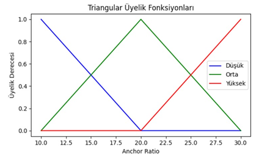
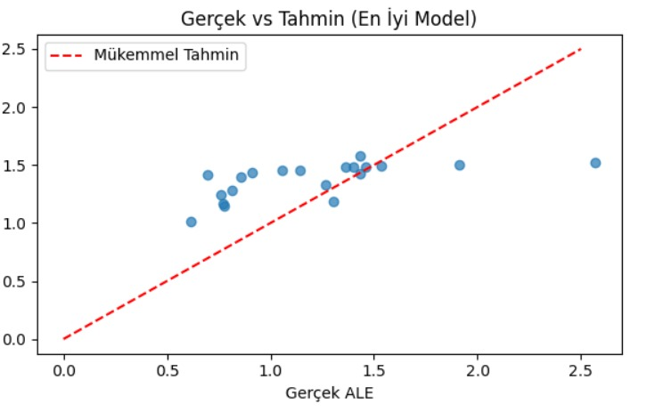

# Esnek Hesaplama Projesi

Bu proje, Mamdani Bulanık Çıkarım Modeli kullanarak Monte Carlo Simülasyon veri seti üzerinden Average Localization Error (ALE) tahmini yapmayı amaçlamaktadır. 

## İçerik

- `README.md`                  : Proje dokümantasyonu  
- `membership_triangular.png`  : Üçgensel üyelik fonksiyonu görselleştirmesi  
- `membership_gaussian.png`    : Gauss üyelik fonksiyonu görselleştirmesi  
- `performance.png`            : Model performans karşılaştırma grafiği  
- `mamdani_rules.txt`          : Kullanılan bulanık IF-THEN kuralları  

## Kullanılan Kütüphaneler

- **NumPy**: Sayısal hesaplamalar için  
- **Matplotlib**: Grafikler ve görselleştirmeler için  
- **scikit-fuzzy** (opsiyonel): Üyelik fonksiyonları ve bulanık mantık araçları  
- **pandas**: Veri okuma ve işleme  
- **scikit-learn**: MAE ve RMSE hesaplamaları  

## Temel Kavramlar

### Mamdani Bulanık Çıkarım Modeli
1. **Bulanıklaştırma (Fuzzification)**: Giriş değerleri üyelik fonksiyonları ile bulanık kümelere dönüştürülür.  
2. **Kural Değerlendirme (Rule Evaluation)**: IF-THEN kuralları uygulanır (AND için min operatörü).  
3. **Çıkarım (Inference)**: Kuralların sonuçları birleştirilir (max operatörü).  
4. **Berraklaştırma (Defuzzification)**: Bulanık sonuç, sayısal değere dönüştürülür. En yaygın yöntem: **Centroid** (ağırlık merkezi).

### Üyelik Fonksiyonları
- **Üçgensel (Triangular)** fonksiyon:  
    
  ```python
  def triangular_mf(x, a, b, c):
      return np.maximum(np.minimum((x-a)/(b-a), (c-x)/(c-b)), 0)
  ```

- **Gauss (Gaussian)** fonksiyon:  
    
  ```python
  def gaussian_mf(x, mean, sigma):
      return np.exp(-0.5 * ((x-mean)/sigma)**2)
  ```

### Performans Metrikleri
- **Mean Absolute Error (MAE)**:  
  \[
  \mathrm{MAE} = \frac{1}{n} \sum_{i=1}^n \bigl|y_i - \hat y_i\bigr|
  \]
- **Root Mean Square Error (RMSE)**:  
  \[
  \mathrm{RMSE} = \sqrt{\frac{1}{n} \sum_{i=1}^n (y_i - \hat y_i)^2}
  \]

Aşağıdaki grafik, farklı model konfigürasyonlarının MAE ve RMSE değerlerini karşılaştırmaktadır:  


## Kullanım

1. Depoyu klonlayın veya indirin.  
2. Gerekli kütüphaneleri yükleyin:
   ```bash
   pip install numpy matplotlib pandas scikit-learn scikit-fuzzy
   ```
3. Python betiklerinizi çalıştırarak üyelik fonksiyonları ve performans grafiğini oluşturun.  
4. Kodunuzda `mamdani_rules.txt` dosyasındaki 11 adet IF-THEN kuralını kullanabilirsiniz.

